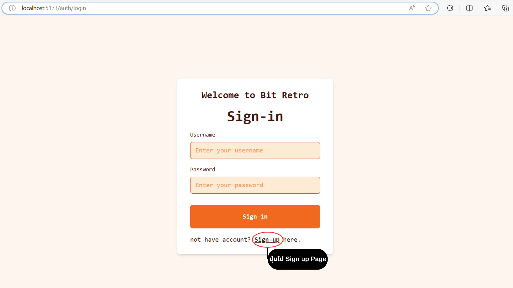
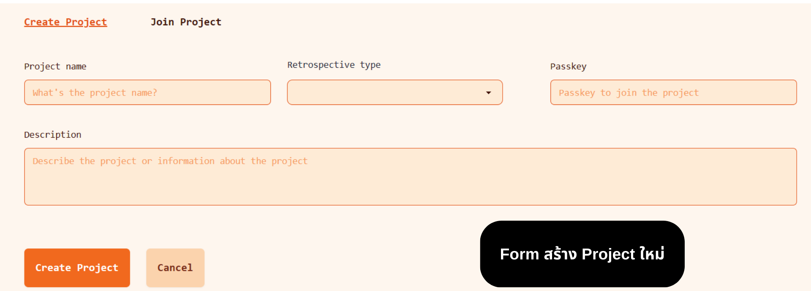
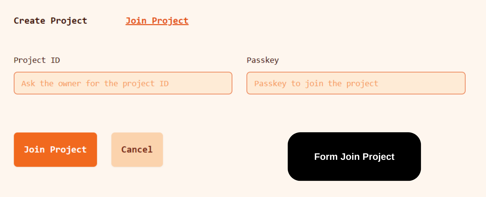
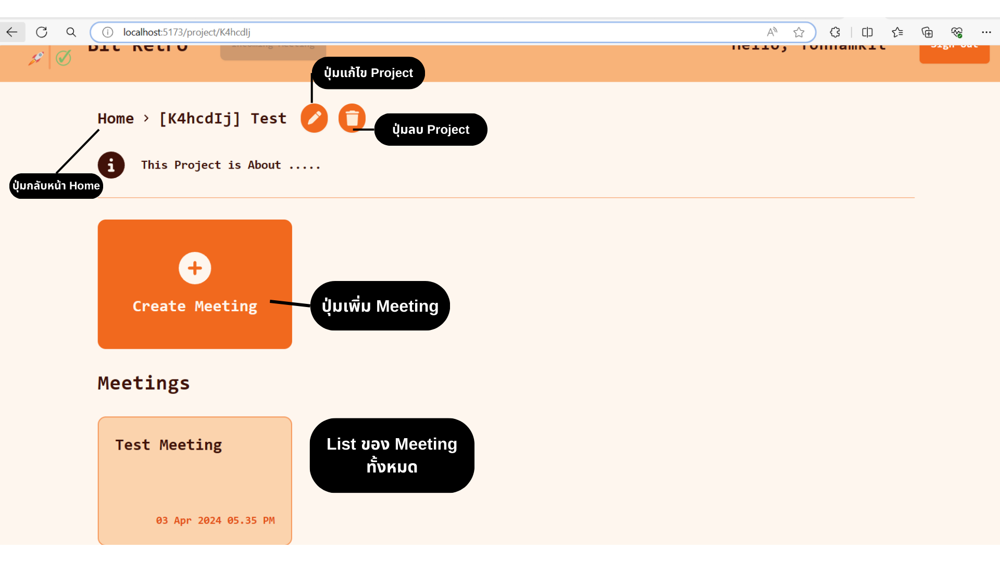
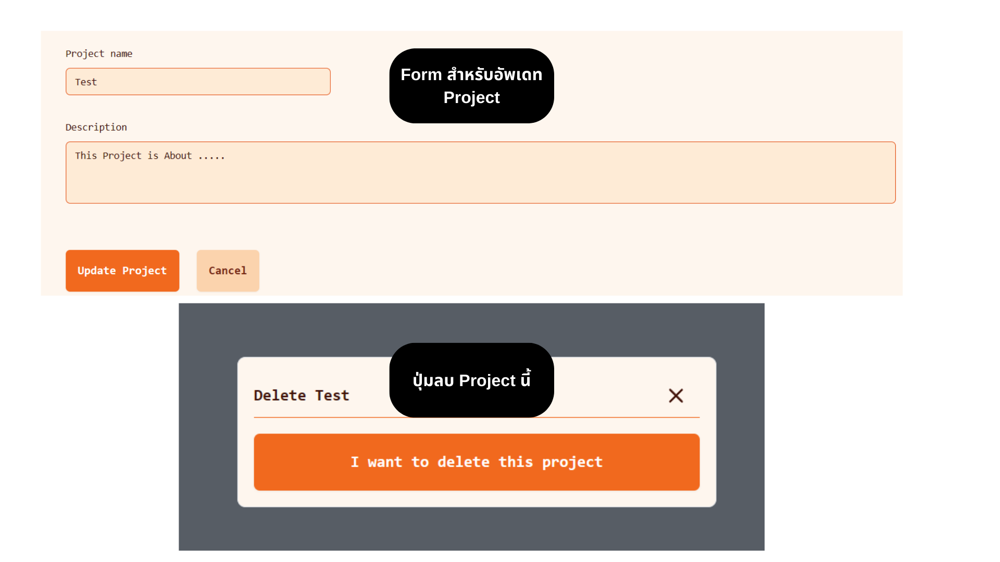
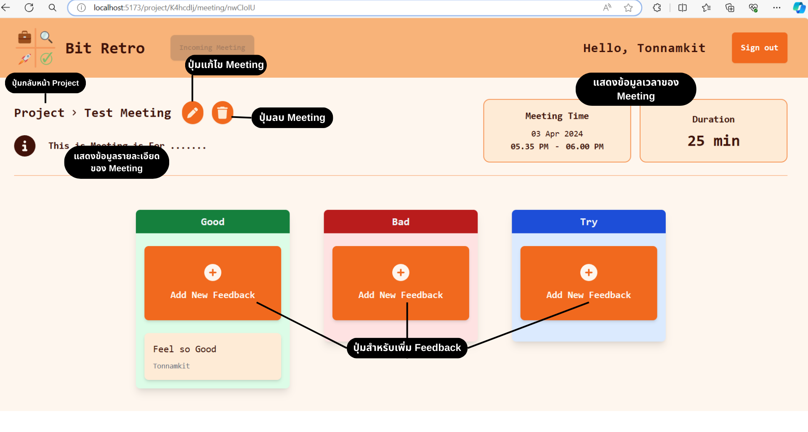
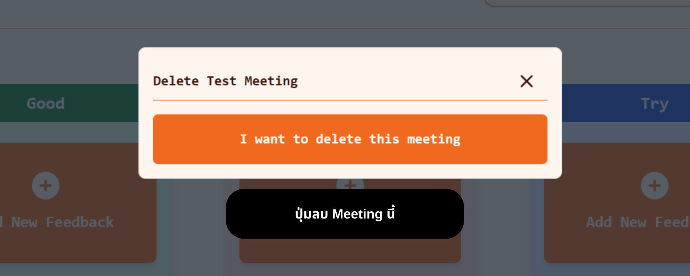
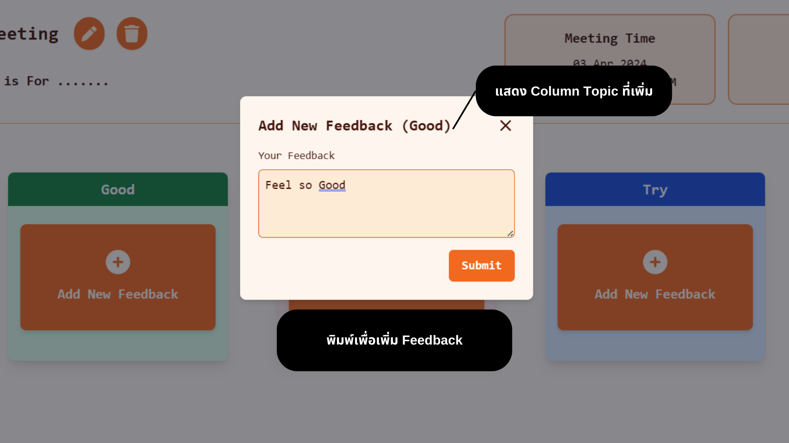
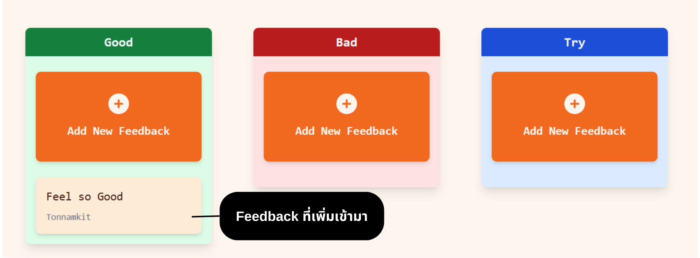
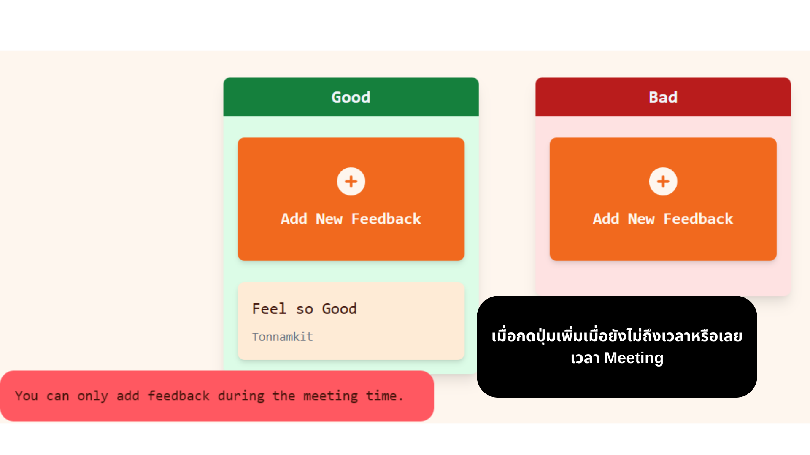

# PROJECT1-SEC-2-bit.ac.th.tew

## สมาชิก

### 1. 65130500066 นายภูวเมศฐ์ ปัญจเฉลิมรัตน์

### 2. 65130500083 นายสรวิชญ์ เครือคำ

### 3. 65130500093 นายกิตติพัฒน์ บัวลอยลม

### 4. 65130500100 นายชินภัทร โลหแสงสุวรรณ

### 5. 65130500106 นายธีรธร เที่ยงธรรม

---

## หน้าที่ความรับผิดชอบ

### 65130500066 นายภูวเมศฐ์ ปัญจเฉลิมรัตน์ (20%)
- UX/UI Design
- Style CSS and DaisyUI
- Home Page
- ListWrap & CollapseBar & CardRetro components

### 65130500083 นายสรวิชญ์ เครือคำ (20%)
- Sign-in/Sign-up Page
- Polling Fetch
- Pinia Store

### 65130500093 นายกิตติพัฒน์ บัวลอยลม (20%)
- Meeting Page
- Design Component Meeting Page
- Implement Design to Meeting Page 

### 65130500100 นายชินภัทร โลหแสงสุวรรณ (20%)
- Data Design
- Backend
- Form Components
- Modify All Components

### 65130500106 นายธีรธร เที่ยงธรรม (20%)
- Navbar Component
- Button Handler In Nabbar
- Base Layout Components
---

## รายการฟีเจอร์ความสามารถของแอปพลิเคชัน
Retrospective application
 - Login/Register ต้องมีบัญชีก่อนเริ่มต้นใช้งาน Application
 - Home Page หน้าแสดงโปรเจ็กต์ทั้งหมด
    - List of Project Page
		 - My Project โปรเจ็กต์ที่เป็นเจ้าของ (สร้างเอง)
		 - Share with Me โปรเจ็กต์ที่เข้าร่วม
	 - Add New Project สร้างโปรเจ็กต์ใหม่
	 - Join Project ใช้ Project ID และ Passkey สำหรับเข้าร่วมโปรเจ็กต์
- List of Meeting Page หน้าแสดง Meeting ทั้งหมดของโปรเจ็กต์
   - List of Meetings แสดง Meetings ทั้งหมดที่มีภายในโปรเจ็กต์นั้นๆ
   - Edit Project แก้ไขช้อมูลของโปรเจ็กต์
   - Delete Project ลบโปรเจ็กต์
   - Add New Meeting สร้าง Meeting ใหม่
 - Meeting Page หน้าแสดงข้อมูล Feedback ทั้งหมดและข้อมูลของ Meeting ครั้งนั้น
   - Retrospective type
      - Good, Bad, Try
      - KALM – Keep, Add, More, Less
    - Add New Feedback สร้าง Feedback ใหม่

---

## คู่มือการใช้งานแอปพลิเคชัน

### Sign-in Page
- กรอก Username และ Password สำหรับเข้าใช้งาน

### Sign-up Page
- กรอก Username และ Password เพื่อสร้าง User ใหม่

### Home Page
- แสดง Project ทั้งหมด
  - My Project แสดง Project ที่เป็นเจ้าของ
  - Share with Me แสดง Project ที่เข้าร่วม
- ปุ่มเข้า Form สร้างหรือเข้าร่วม Project
- ปุ่มเข้า Meeting ที่กำลังจะเริ่ม 

### Project Create Form
- Form สร้าง Project ใหม่
- ข้อมูลที่กรอก
  - ชื่อ Project
  - Retrospective Type เพื่อกำหนด Type ที่ใช้ของ Project
    - มีให้เลือก 2 ประเภท 1. Good-Bad-Try 2. Keep-Add-Less-More
  - Passkey สำหรับเข้าร่วม Project
  - คำอธิบายเพิ่มเติมของ Project

### Project Join Form
- Form สำหรับเข้าร่วม Meeting

### Project Page
- ปุ่มกลับหน้า Home Page
- ปุ่มแก้ไขและลบ Project
- ปุ่มเพิ่ม Meeting ใหม่
- แสดง Meeting ทั้งที่มีของ Project

### Project Update Form & Project Delete
- Form แก้ไขข้อมูลของ Project
- ลบ Project

### Meeting Page
- ปุ่มกลับหน้า Project Page
- ปุ่มแก้ไขและลบ Meeting
- แสดง Feedback ทั้งหมดตาม Type ที่กำหนดของ Project
- ปุ่มเพิ่ม Feedback

### Meeting Update Form & Meeting Delete
- Form แก้ไขข้อมูลของ Meeting
- ลบ Meeting

### Feedback Form
- Form เพิ่ม Feedback ใหม่ตาม Column

### After Add New Feedback

### Meeting Timeout
- เมื่อ Meeting ยังไม่ถึงเวลาหรือหมดเวลาจะไม่สามารถเพิ่ม Feedback ใหม่

---

## คลิปสาธิต features ของแอปพลิเคชัน
[video-Link](https://drive.google.com/file/d/1eQD6WRRUWFViQAVm7Xa9wQrnWTG1f7t_/view?usp=sharing)
---

## แหล่งข้อมูลอ้างอิง

---
