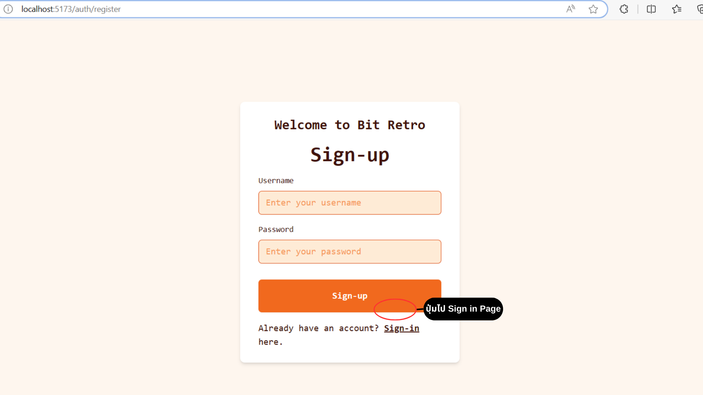
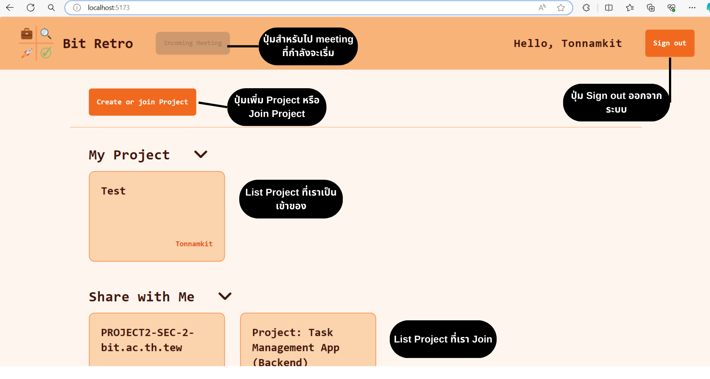
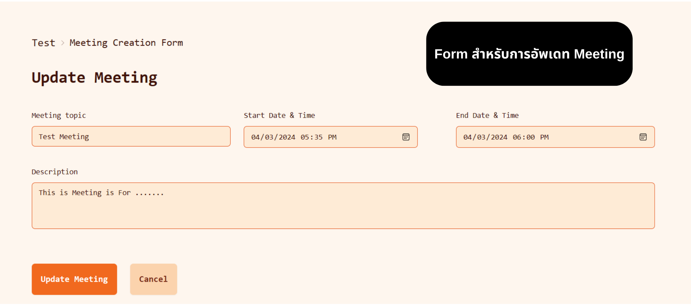

# PROJECT1-SEC-2-bit.ac.th.tew

## สมาชิก

### 1. 65130500066 นายภูวเมศฐ์ ปัญจเฉลิมรัตน์

### 2. 65130500083 นายสรวิชญ์ เครือคำ

### 3. 65130500093 นายกิตติพัฒน์ บัวลอยลม

### 4. 65130500100 นายชินภัทร โลหแสงสุวรรณ

### 5. 65130500106 นายธีรธร เที่ยงธรรม

---

## หน้าที่ความรับผิดชอบ

### 65130500066 นายภูวเมศฐ์ ปัญจเฉลิมรัตน์

### 65130500083 นายสรวิชญ์ เครือคำ

### 65130500093 นายกิตติพัฒน์ บัวลอยลม

### 65130500100 นายชินภัทร โลหแสงสุวรรณ

### 65130500106 นายธีรธร เที่ยงธรรม

---

## รายการฟีเจอร์ความสามารถของแอปพลิเคชัน

---

## คู่มือการใช้งานแอปพลิเคชัน

### Sign-in Page
- กรอก Username และ Password สำหรับเข้าใช้งาน

### Sign-up Page
- กรอก Username และ Password เพื่อสร้าง User ใหม่

### Home Page
- แสดง Project ทั้งหมด
  - My Project แสดง Project ที่เป็นเจ้าของ
  - Share with Me แสดง Project ที่เข้าร่วม
- ปุ่มเข้า Form สร้างหรือเข้าร่วม Project
- ปุ่มเข้า Meeting ที่กำลังจะเริ่ม 

### Project Create Form
- Form สร้าง Project ใหม่
- ข้อมูลที่กรอก
  - ชื่อ Project
  - Retrospective Type เพื่อกำหนด Type ที่ใช้ของ Project
    - มีให้เลือก 2 ประเภท 1. Good-Bad-Try 2. Keep-Add-Less-More
  - Passkey สำหรับเข้าร่วม Project
  - คำอธิบายเพิ่มเติมของ Project

### Project Join Form
- Form สำหรับเข้าร่วม Meeting

### Project Page
- ปุ่มกลับหน้า Home Page
- ปุ่มแก้ไขและลบ Project
- ปุ่มเพิ่ม Meeting ใหม่
- แสดง Meeting ทั้งที่มีของ Project

### Project Update Form & Project Delete
- Form แก้ไขข้อมูลของ Project
- ลบ Project

### Meeting Page
- ปุ่มกลับหน้า Project Page
- ปุ่มแก้ไขและลบ Meeting
- แสดง Feedback ทั้งหมดตาม Type ที่กำหนดของ Project
- ปุ่มเพิ่ม Feedback

### Meeting Update Form & Meeting Delete
- Form แก้ไขข้อมูลของ Meeting
- ลบ Meeting

### Feedback Form
- Form เพิ่ม Feedback ใหม่ตาม Column

### After Add New Feedback

### Meeting Timeout
- เมื่อ Meeting ยังไม่ถึงเวลาหรือหมดเวลาจะไม่สามารถเพิ่ม Feedback ใหม่

## คลิปสาธิต features ของแอปพลิเคชัน

---

## แหล่งข้อมูลอ้างอิง

---
